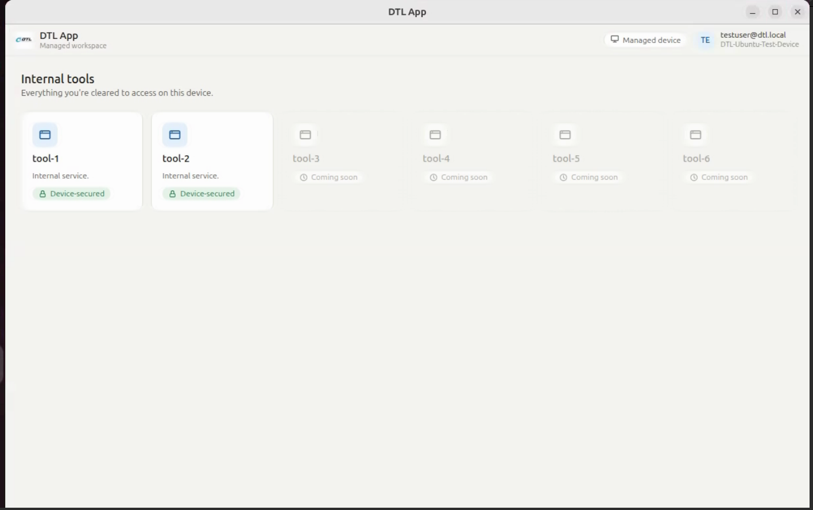
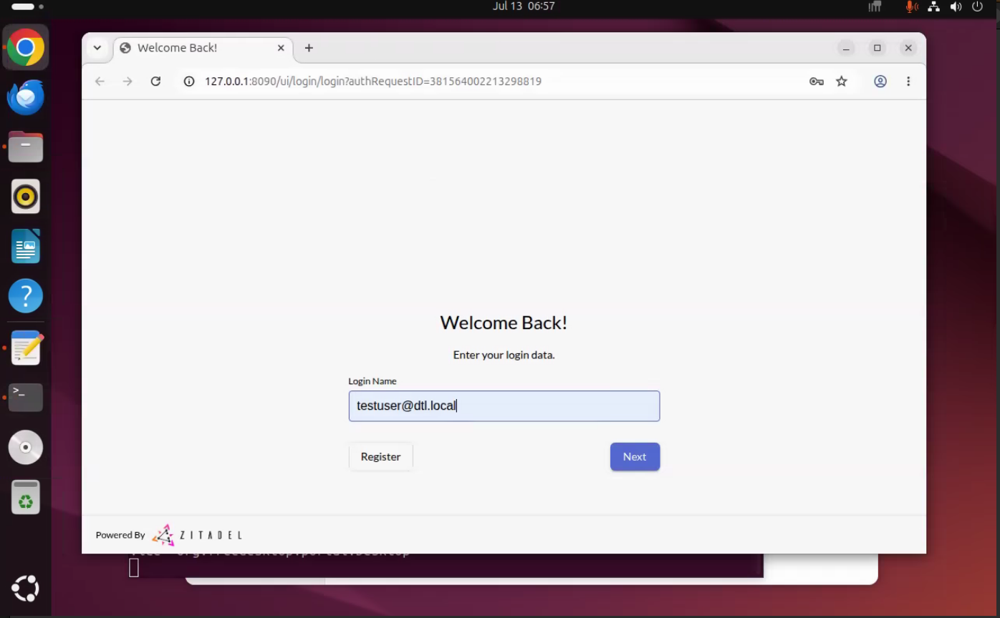
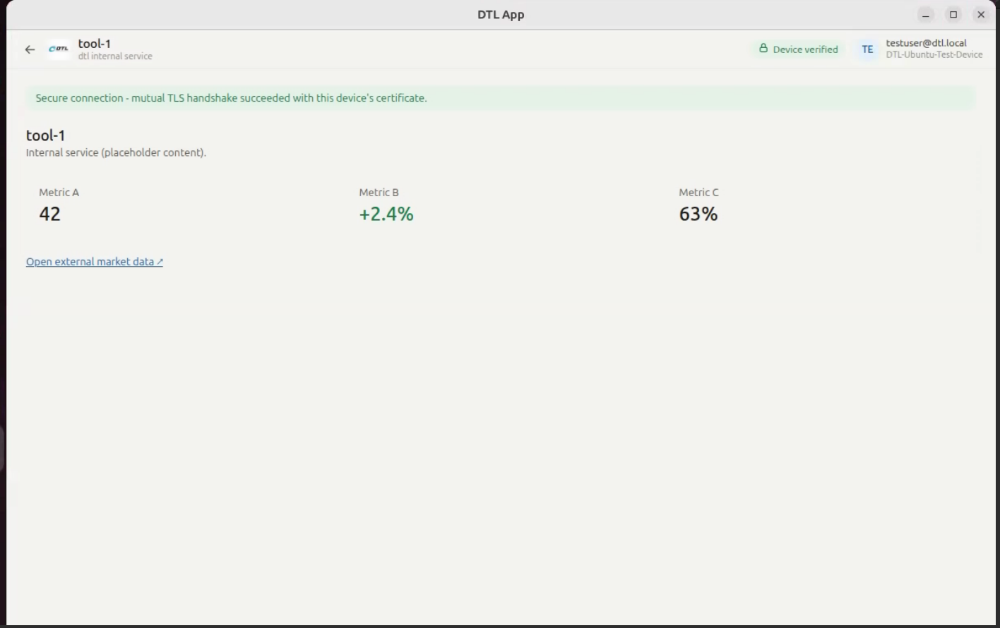
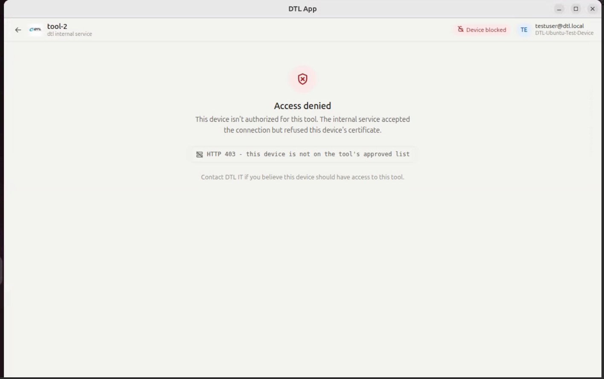
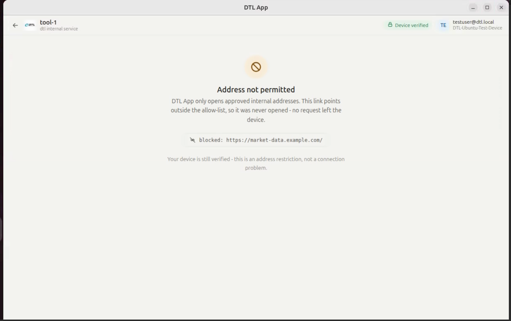
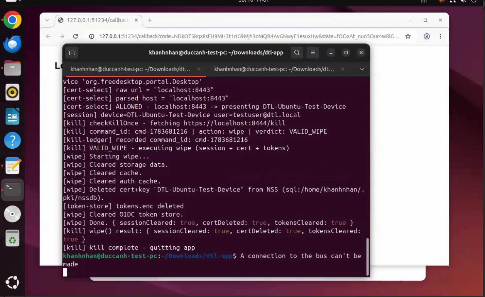
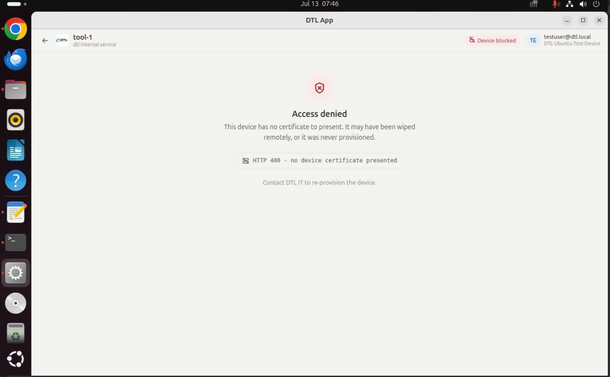

# DTL App (Proof of Concept)

DTL App replaces standard browsers to provide a secure, locked-down gateway for accessing DTL's internal tools. Designed to enforce strict access management and corporate data protection, it requires independent validation of both the physical device and the authenticated employee, while integrating a remote kill-switch to immediately wipe local corporate credentials if the device is compromised.

The main goal of this project was to show we can build a browser we fully control.

## Features

### 1. Custom Branding & Home Launcher

The application is fully customized as "DTL App" across the window title and system menus. It opens directly into a locked home page that restricts navigation strictly to approved corporate tools. Currently, two active tools (`tool-1` and `tool-2`) are functional for lab testing, while the rest serve as placeholders.

### 2. Custom Authentication (OIDC)

The application locks access until the user logs in through our identity provider `Zitadel` (configured for the test environment). The login flow opens in the system browser using the standard OIDC protocol and only allows accounts from the corporate domain (`@dtl.local` in the lab). 

For testing purposes, a default account has been pre-created:
* **Username:** `testuser@dtl.local`
* **Password:** `Test1234!`

Once logged in, the tokens are encrypted and stored directly inside the operating system's keyring. This keeps the session active so users do not need to log in again every time the app restarts.

### 3. Device Identity (mTLS)

To demonstrate our capability to fully customize client-side verification, the application enforces a unique cryptographic identity for every machine. Each machine is provisioned with a distinct client certificate bound to a specific expiration date, allowing the infrastructure to identify and verify the exact client machine.

Crucially, the certificate resides within the OS certificate store rather than inside the application bundle. This ensures that reinstalling the app preserves the machine's identity, while copying the application binary to another device will not clone its access rights.

In the lab, the certificate is issued by a self-signed CA through a provisioning script and loaded into the machine's NSS store. Provisioning is deliberately separate from installing the app so the app never generates its own identity, it only presents one that was granted to the machine.

The browser presents this unique certificate exclusively to allowlisted internal hosts, which evaluate access permissions on a per-device basis. The lab environment demonstrates three operational outcomes:

* **Approved Device (tool-1):** The server validates the certificate, the page loads successfully, and the badge turns green `Device verified`.

  

* **Blocked Device (tool-2):** The server detects the certificate but explicitly denies this specific device instance, returning an HTTP 403 error and a red badge `Device blocked`.

  

* **Unlisted Navigation:** Any link pointing outside the corporate allowlist is blocked locally via an amber warning page. The request never leaves the machine, ensuring the device identity is never exposed.

  

**Technical note (PoC Scope):** Device certificates in the lab are issued with an 825-day lifespan, but we have not built anything to handle one lapsing. An expired certificate fails at the TLS handshake, before any HTTP response exists, so it never reaches the access-denied page that a refused (403) or missing (400) certificate goes through. It lands instead in the app's load-failure path, which today only logs to the console: the user would see a blank view with the badge unchanged and no explanation. Production needs a renewal policy and a proper message on that failure path.

### 4. Remote Kill Switch

To demonstrate remote revocation without an Mobile Device Management (MDM), the application polls a fixed HTTPS control-plane endpoint every 30 seconds. In the lab, this endpoint is served by the local nginx instance at `https://localhost:8444/kill`, which returns a small JSON command signed with an Ed25519 key. The lab serves that command from a static file, so a spent command keeps being offered until it is replaced, whereas a real control plane would simply answer that there is no command. The command format and the app side are unchanged either way.

The app executes a wipe only when every check passes: the signature must verify against the trusted public key, the command must name this specific device, it must be fresh (issued within the last 24 hours), and it must not have been executed before. A ledger of executed command IDs prevents an old command from being replayed.

Once a valid wipe command is received, the app destroys its own access: session data, the device certificate, and the encrypted tokens. It then quits. The demonstration produces two observable outcomes:

* **Execution:** The terminal logs the verdict, the wipe result, and the shutdown. There is nothing left on the machine to authenticate with.

  

* **Lockout:** On the next launch, the user can still sign in through OIDC, but the device certificate is gone. The internal tools reject the machine, and access only returns once the certificate is re-provisioned manually. The asymmetry here is deliberate. Revoking access is remote and instant while restoring it is not. A signed command can lock a machine out from anywhere, but bringing it back requires someone to re-provision the certificate on that machine.

  

The switch also fails safe, in both directions. A command that does not verify is logged and ignored rather than acted on. And if the endpoint cannot be reached, the app does nothing and keeps running, so the user can still log in and use the internal tools. A wipe only happens when a valid signed command actually arrives, never because one failed to.

---

## Path to production

### Linux

The application itself is finished. What is not finished is everything around it, because the lab fakes those parts locally. The app will need each of them in production:

* **Issuing certificates to machines.** The lab uses a throwaway CA and a manual script to provision device certificates. A production rollout requires a real internal CA and a defined lifecycle strategy: establishing who provisions new machines, when it occurs, and how certificates are revoked for lost devices or offboarded employees. This is a company-wide operational framework rather than application code.

* **Enforcing mTLS on internal services.** Our internal services do not request a client certificate today, so the lab stands up an nginx server that does. In production, the app requires configuring each internal web application to trust our CA and handle device-level authorization. This configuration takes place on the infrastructure side rather than inside the browser app, scaling with the number of integrated applications.

* **Central Identity Provider (IdP) Integration.** The lab runs its own login server on the test machine. In production the application would point at whatever identity provider the company already uses. The app only needs the address of that provider and an identifier for itself.

* **Building a real control plane for the kill switch.** The lab currently serves the kill command as a static signed file via Nginx. Production requires a dedicated service to issue signed commands, with the signing key securely hosted within the company’s standard key management infrastructure. The underlying command format and client-side implementation remain unchanged.

**Delivering per-machine settings.** The application needs a few values that differ from machine to machine, such as the address of the identity provider and the key it trusts for kill commands. In the lab a wrapper script supplies them at launch, which is why for the demo we should not open the app from the desktop menu, because the menu entry does not go through that script. A rollout needs those settings delivered properly, through a system configuration file or through whatever tool manages our Linux machines, so that the application works no matter how it is started.

### Windows

Everything in the Linux list still applies, and what follows is only what is specific to Windows.

The application code carries over unchanged, because Electron builds Windows binaries from the same source and our packaging tool already produces Windows installers. What changes is the plumbing around certificates. Windows keeps them in its own certificate store, which Electron reads natively, so only the provisioning scripts need rewriting from bash into PowerShell. Token storage actually gets easier, because Windows encrypts them through a built-in mechanism so we don't need the keyring setup on Linux.

### macOS

This one is no longer speculation. The app builds for macOS from the same source, as a universal binary that runs natively on both Intel and Apple Silicon, no Rosetta involved. All five features work, verified end to end from the installed `.dmg`, not from a dev tree. Certificates live in the macOS Keychain instead of Linux's NSS store, and the app's certificate-selection code needed no changes at all for that. The kill switch deletes the Keychain identity rather than the NSS certificate, which is the only application code that differs between the two platforms.

What genuinely remains:

* **Code signing and notarization.** This is the real remaining item. It needs an Apple developer account, and it turns out to matter more than expected. An unsigned app is not only blocked by Gatekeeper on download, it also cannot be verified by the Keychain, so the user gets an authorization prompt the first time the app uses its certificate. Signing fixes both.

* **Certificate provisioning is more constrained than on Linux.** The command that loads a certificate into the Keychain refuses to run without an interactive login session, so it cannot be scripted over a remote connection the way the Linux equivalent can. Whoever provisions machines has to account for that.

One honest caveat on the test environment: this was verified on an emulated macOS 12 virtual machine, not on current Apple hardware, so treat behavior on a modern Mac as very likely but not confirmed.

See [docs/setup-guide-macos.md](docs/setup-guide-macos.md) for the exact steps.

### iOS and Android

Mobile is not a port. Electron does not run on phones, so this would be a second codebase that shares specifications with the desktop application rather than sharing code.

What carries across is design rather than implementation. The kill command format was deliberately made independent of any programming language, so a mobile client can verify the same signature, and the login flow is standard on both platforms.

The one item worth flagging now is client certificates on iOS. Apple forces applications through its own web view, where certificate handling is possible but far more constrained than on desktop. We would want a small experiment there before committing to anything, because it is the hardest part of the mobile development process.

## Downloads

| Platform | Package | Status |
|---|---|---|
| Linux (Debian, Ubuntu) | [`dtl-app_0.1.0_amd64.deb`](http://gitlab.intern.dtl/khanhnhan/dtl-app-poc/-/packages/1) | Available |
| Windows | `.exe` installer | Coming soon |
| macOS (Intel, Apple Silicon) | [`DTL App-0.1.0-universal.dmg`](TODO) | Available |
| iOS, Android | TBD | TBD |

## Trying it yourself

The demo runs on any Ubuntu machine that meets the prerequisites, and it needs no manual configuration. One script brings up the whole lab, meaning the certificates, the internal endpoints it protects, and the identity provider with a test user already seeded. A second script launches the application. From there you can walk through every feature above, including the kill switch and the lockout that follows it.

Step by step instructions are in [docs/setup-guide.md](docs/setup-guide.md) for Linux, and [docs/setup-guide-macos.md](docs/setup-guide-macos.md) for macOS.
